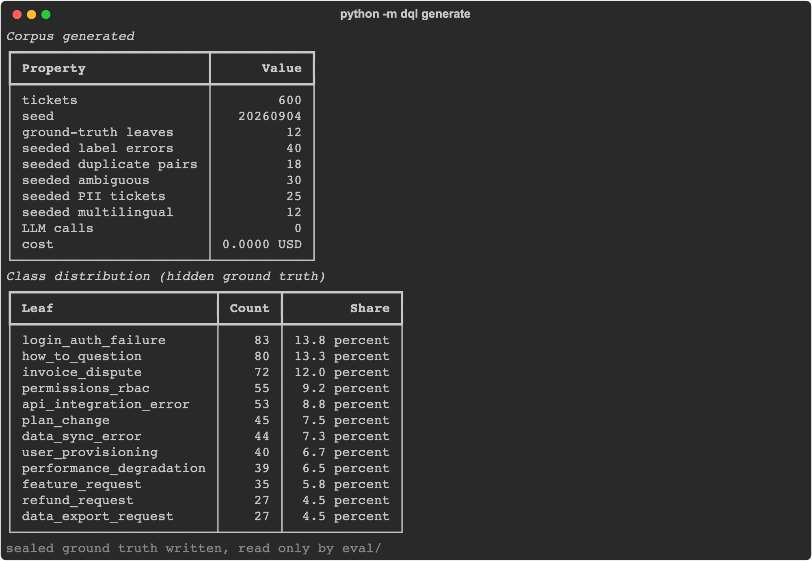
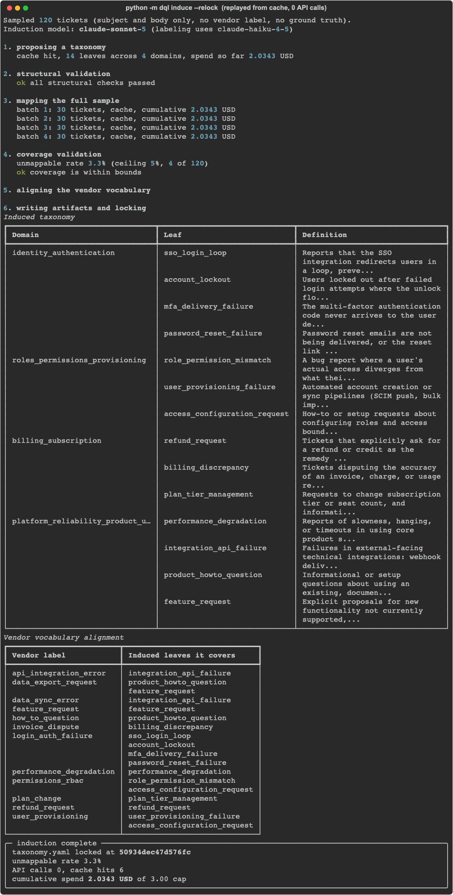
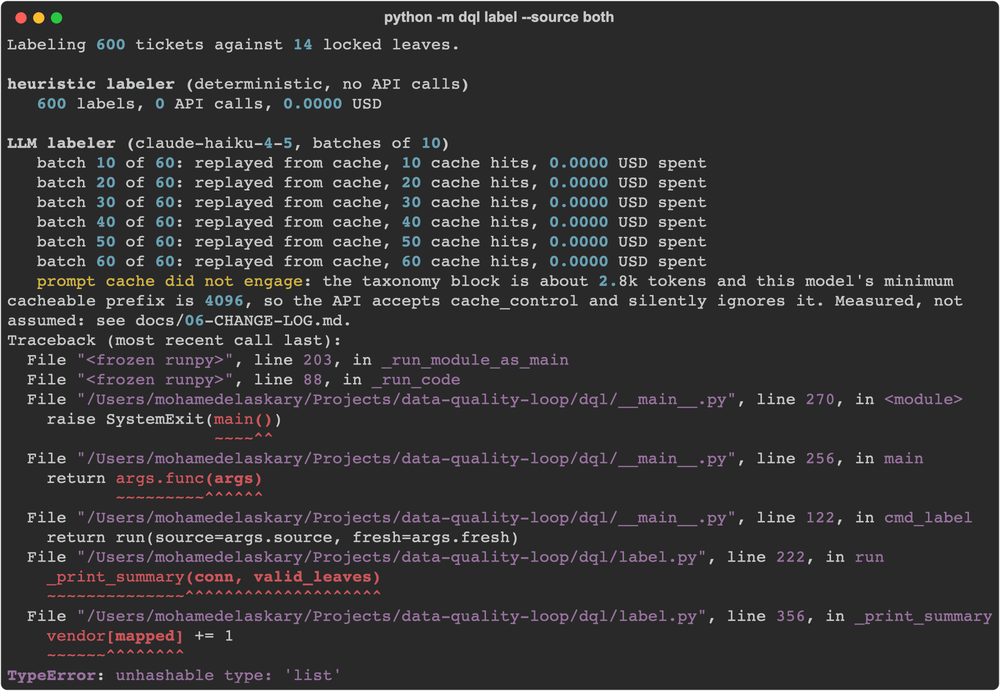
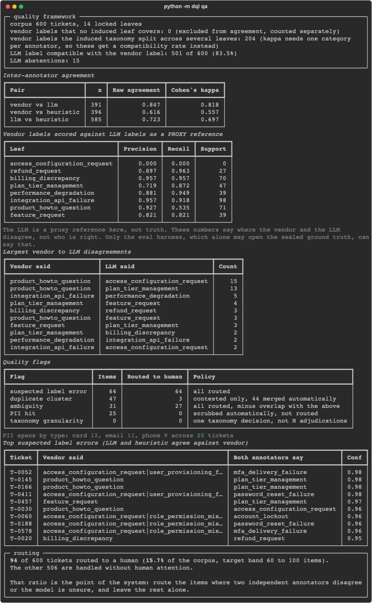
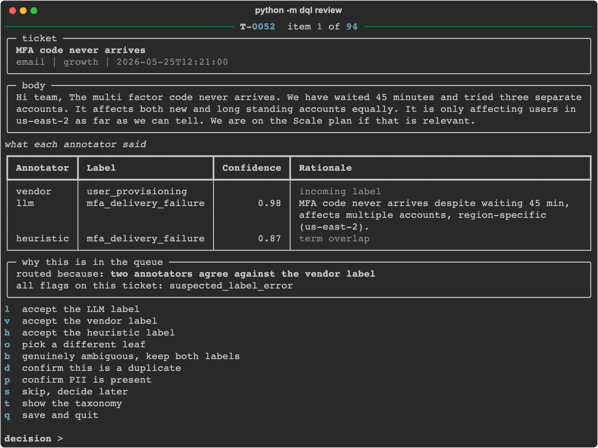
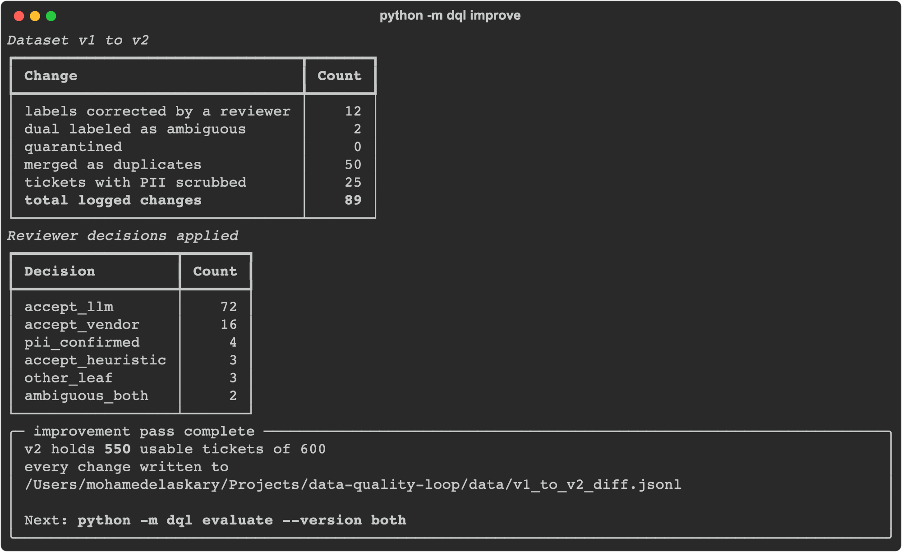
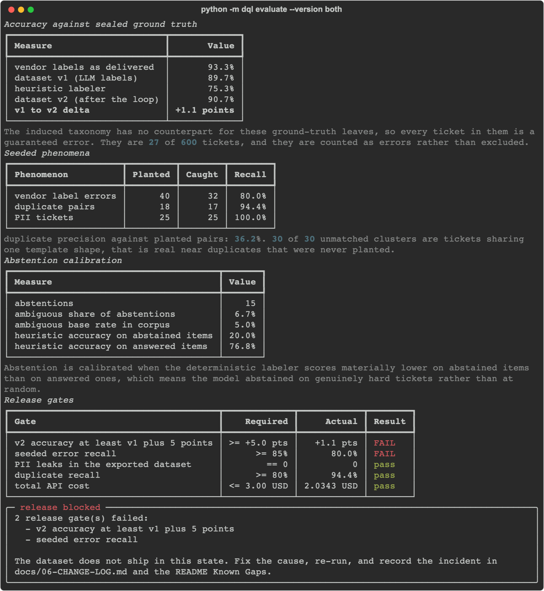
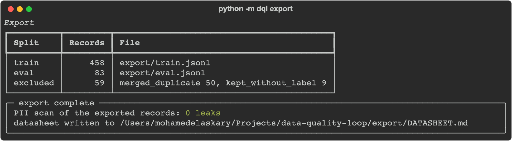

# data-quality-loop

A training-data intelligence system: taxonomy induction, programmatic labeling,
quality measurement, human-in-the-loop review, and a measured dataset
improvement cycle, with an eval harness gating every release.

**Two of the five release gates fail, and they are left failing.** Both failures
have a one-sentence structural cause, stated below. Moving a threshold until the
board went green would have made every other number here less believable.

---

## At a glance

| What | Why it matters |
|---|---|
| A Claude agent induces the label taxonomy from unlabeled tickets, and deterministic validators reject it until it is usable | Taxonomy design is the part of a labeling programme that decides everything downstream, and a fluent proposal can still be structurally unusable |
| Two independent annotators label every ticket, one LLM and one deterministic | Agreement between independent annotators is what makes a kappa mean anything, and the deterministic one keeps working when the API does not |
| 143 of the 600 tickets carry a defect planted on purpose, sealed in a file only the eval harness may read | Recall against a known answer key is the difference between measuring quality and asserting it |
| 15.7 percent of the corpus reaches a human, the rest is handled automatically | A system that routes everything has no value and one that routes nothing has no safety. The ratio is the product |
| Release gates block the dataset from shipping, and currently two of them do | An eval that has never failed is an eval nobody is reading |
| Total API spend for everything in this README: 2.0343 USD | Reproducible from a committed response cache at zero further cost |

---

## Headline results

Every figure is read from `eval/results_v1.json`, `eval/results_v2.json`, or the
pipeline's own SQLite store. Nothing here is estimated or typed in by hand.

| Metric | v1 (pipeline output) | v2 (after the loop) |
|---|---|---|
| Label accuracy vs sealed ground truth | 89.7% | **90.7%** (+1.1 pts) |
| Seeded label errors caught (of 40) | 32 (80.0%) | 31 corrected |
| Duplicate pairs found (of 18) | 17 (94.4%) | 50 records merged |
| PII tickets caught (of 25) / leaks in export | 25 (100%) | **0 leaks** |
| Cohen's kappa, LLM vs heuristic | 0.697 | |
| Items routed to a human / total | 94 / 600 (15.7%) | |
| Human review time | 44.1 minutes, median 16.0s per item | |
| Total API cost | 2.0343 USD | |

**Context for the accuracy numbers.** The incoming vendor labels score 93.3
percent against ground truth, above dataset v2 at 90.7 percent. The induced
taxonomy genuinely loses accuracy on this corpus. It is explained under Known
Gaps rather than omitted.

### Release gates

| Gate | Required | Actual | |
|---|---|---|---|
| PII leaks in the exported dataset | 0 | 0 | pass |
| Duplicate recall | >= 80% | 94.4% | pass |
| Total API cost | <= 3.00 USD | 2.0343 USD | pass |
| Seeded label error recall | >= 85% | 80.0% | **fail** |
| v2 accuracy at least v1 plus 5 points | >= +5.0 pts | +1.1 pts | **fail** |

`python -m dql evaluate` exits non-zero.

---

## Architecture

```mermaid
flowchart LR
    G["Corpus generator<br/>600 tickets, fixed seed<br/>seeded truth sealed"] --> C[("SQLite<br/>state + cache + costs")]
    C --> T["Taxonomy induction<br/>Claude agent + validators<br/>locked by hash"]
    T --> L1["LLM labeler<br/>structured output, confidence"]
    T --> L2["Heuristic labeler<br/>deterministic rules"]
    L1 --> Q["Quality framework<br/>kappa, confusion, error detection<br/>duplicates, PII, ambiguity"]
    L2 --> Q
    Q -->|"disagreement, low confidence, flags"| H["Human review queue<br/>94 items, timed, resumable"]
    Q -->|clean| D1["Dataset v1<br/>89.7 percent"]
    H --> I["Improvement pass<br/>corrections, dedup, PII scrub"]
    D1 --> I
    I --> D2["Dataset v2<br/>90.7 percent"]
    D1 --> E["Eval harness<br/>sealed ground truth<br/>5 release gates"]
    D2 --> E
    E --> R["REPORT.md + train.jsonl<br/>eval.jsonl + DATASHEET.md"]
```



Also exported as [`assets/architecture.svg`](assets/architecture.svg).

---

## The pipeline, stage by stage

Every screenshot below is real terminal output from the committed run.

### 1. Generate

600 tickets from templates at a fixed seed, zero model calls. Five phenomena are
planted on mutually disjoint ticket sets and sealed into a ground-truth file:
40 vendor label errors drawn from a plausible confusion map, 18 near-duplicate
paraphrase pairs, 30 genuinely ambiguous tickets carrying two defensible labels,
25 tickets with synthetic PII at recorded spans, and 12 mixing English and
Arabic.



### 2. Induce

A Claude agent reads 120 unlabeled tickets and proposes a taxonomy. It never
sees the vendor labels or the ground truth. Deterministic validators then decide
whether the proposal is usable, and rejected it five separate times across the
build: 5 domains, 17 leaves, a duplicated leaf name, a domain name used as a
leaf, and a single-leaf domain. The result is locked by sha256.

The run below is a replay from the response cache: 6 cache hits, 0 API calls,
reproducing the byte-identical taxonomy hash.



### 3. Label

Two annotators over the locked 14-leaf taxonomy. The LLM labeler returns a
label, a confidence, a rationale capped at 25 words, and an explicit abstain
flag. The heuristic labeler is built from the taxonomy text alone and never sees
ground truth or the vendor label.



### 4. QA

Agreement, per-class confusion, suspected label errors, near duplicates, a PII
battery, and ambiguity flags. Then deterministic routing.



### 5. Review

The 94 routed items, one per screen, with every annotator's label and the reason
the item was routed. Timed per decision and resumable.



### 6. Improve

Dataset v2 from v1 plus adjudications plus automated fixes. 89 changes, every
one written to `data/v1_to_v2_diff.jsonl` with field, before, after, and reason.



### 7. Evaluate

The only component permitted to open the sealed ground truth. Scores both
versions and enforces the gates.



### 8. Export

458 train and 83 eval records, stratified 85/15, plus a datasheet. Export scans
its own output for PII and refuses to write if anything survived the scrub.



---

## Quickstart

```bash
git clone https://github.com/melaskary72/data-quality-loop
cd data-quality-loop
make venv                  # Python 3.13 via uv, six allowlisted dependencies
cp .env.example .env       # add ANTHROPIC_API_KEY only if regenerating the cache
make demo                  # every stage except review, which needs a human
make review                # the human queue
make check                 # contract check, seed verification, yamlio selftest
```

`make demo` replays committed model responses from the cache, so a fresh clone
reproduces every number in this README at zero API cost. A key is only needed to
regenerate the cache with `--fresh`.

---

## The improvement cycle

This is the section the whole repo exists for.

| Measure | v1 | v2 | Delta |
|---|---|---|---|
| Label accuracy vs ground truth | 89.7% | 90.7% | **+1.1 pts** |
| Seeded label errors still wrong | 8 of 40 | 9 of 40 corrected of 32 caught | 31 fixed |
| Duplicate records in the dataset | 50 | 0 | 50 merged |
| Tickets carrying PII | 25 | 0 | 32 spans scrubbed |
| Records fit to export | 600 raw | 541 | 50 merged, 9 unlabeled |

**What the loop actually bought.** 31 of the 32 detected label errors were
corrected, a 96.9 percent correction rate on what QA caught. Every duplicate was
merged and every PII span scrubbed, with zero leaks surviving into the export.
Accuracy moved 1.1 points.

**Why 1.1 and not 5.** Two hard limits, both measured rather than argued:

1. v1 is already 89.7 percent, so there are only 62 wrong tickets to fix.
2. **27 of those 62 are `data_export_request`.** The induced taxonomy has no
   leaf for that class at all, so no label the system can emit is scoreable as
   correct, and no amount of human review reaches them. Adding the leaf would
   mean designing the vocabulary from the answer key.

That leaves 35 reachable errors, of which the loop fixed most of what it saw.
The gate asks for 30 corrected tickets from a pool of 35 that a human sees 15.7
percent of. It is not reachable in this architecture, and the honest response is
to report that rather than lower the bar.

---

## Known gaps and honest state

Dated 2026-09-05. Everything below is a real limitation of the committed run.

**Two release gates fail.**

- *Seeded error recall is 80.0 percent against an 85 percent gate.* The measured
  ceiling is 87.5 percent: 5 of the 40 planted errors were independently
  reproduced by the LLM labeler, and a detector built on annotator disagreement
  cannot catch an error that both annotators share. Recall was lifted from 65.0
  to 80.0 percent by fixing two real defects. The last 5 points would require
  tuning a confidence threshold against the answer key, which is the one thing
  the sealed-truth design exists to prevent.
- *v2 accuracy improved 1.1 points against a 5 point gate*, for the structural
  reason above.

**The vendor's labels beat ours.** Measured against ground truth, the incoming
vendor labels score 93.3 percent and dataset v2 scores 90.7. The induced
taxonomy loses accuracy, almost entirely through the `data_export_request`
coverage gap. A pipeline that does not beat its input on every measure is a
normal outcome; hiding it would not be.

**Duplicate precision is 36.2 percent against the planted pairs.** All 30
unmatched clusters consist of tickets built from the same template shape, so
they are real textual near duplicates that were never planted. The denominator
is stated rather than adjusted.

**Kappa is computed on a non-random subset.** n=391 of 600, the tickets whose
vendor label maps to exactly one induced leaf. The coarse vendor classes are
excluded because a single category does not exist for them; they get a
compatibility rate instead, 83.5 percent.

**One alignment entry is worth attacking.** `access_configuration_request` maps
to two ground-truth leaves in `eval/taxonomy_alignment.yaml`. If that is too
generous, accuracy is overstated. It is flagged in the alignment file itself.

**Seeded phenomena are disjoint.** Each planted defect sits on its own ticket
set so each detector can be scored without confounding. Real corpora routinely
contain a mislabeled duplicate that also carries PII.

**The corpus is synthetic and small.** 600 template-generated tickets have less
variety than real support text. Suitable for demonstrating a measured loop, not
for training anything.

**Prompt caching does not engage.** The taxonomy block is 2844 tokens and this
model's minimum cacheable prefix is 4096, so the API accepts `cache_control` and
silently ignores it. Measured with a padded probe, not assumed. The prompt was
not padded to cross the threshold.

**The human review pass needed a guard.** During the first pass the reviewer
held the accept key down and recorded 22 identical decisions in five seconds.
Those were removed and the items re-reviewed. A fast-adjudication guard now
interrupts on a sustained run of fast identical decisions and asks for
confirmation rather than discarding silently.

Nine further bugs found and fixed during the build are recorded in
[`docs/06-CHANGE-LOG.md`](docs/06-CHANGE-LOG.md), including a hung request that
stalled a run for 35 minutes and an API call whose cost was never billed.

---

## Reading order

1. [`BUILD_CONTRACT.md`](BUILD_CONTRACT.md), the clauses that must not drift
2. [`specs/requirements.md`](specs/requirements.md), numbered and testable
3. [`specs/design.md`](specs/design.md), the technical design and its reasoning
4. [`specs/tasks.md`](specs/tasks.md), every completed task with a dated verification stamp
5. [`docs/02-RISK-REGISTER.md`](docs/02-RISK-REGISTER.md), the risks that fired
6. [`docs/06-CHANGE-LOG.md`](docs/06-CHANGE-LOG.md), every bug found during the build
7. [`REPORT.md`](REPORT.md), v1 against v2
8. [`export/DATASHEET.md`](export/DATASHEET.md), the dataset documentation
9. [`docs/07-AI-USAGE.md`](docs/07-AI-USAGE.md), what was AI written and how it was checked

---

## Folder map

| Path | What is in it |
|---|---|
| `dql/` | the pipeline: generate, induce, label, qa, review, improve, report, export |
| `eval/` | the harness, the hand-written alignment table, and both results files. The only code permitted to read the sealed ground truth |
| `specs/` | requirements, design, and the stamped task list |
| `docs/` | the SDLC package, 00 through 07 |
| `scripts/` | `check_contract.py` and `verify_seeds.py`, both green |
| `data/` | the store, the sealed ground truth, adjudications, and the v1 to v2 diff |
| `export/` | `train.jsonl`, `eval.jsonl`, `DATASHEET.md` |
| `assets/` | the architecture diagram and one screenshot per stage |

---

## Cost

**2.0343 USD** total, for everything in this README: three full labeling passes
over 600 tickets, several taxonomy induction attempts, and the vendor alignment.
Against a hard 3.00 USD cap enforced before each call is sent, not after.

Generation, the heuristic labeler, QA, the improvement pass, the eval harness,
and export make no model calls at all.

| Stage | Calls | Tokens in | Tokens out | USD |
|---|---|---|---|---|
| label | 180 | 757,092 | 106,492 | 1.2896 |
| induce | 33 | 193,154 | 72,933 | 0.7447 |
| **total** | **213** | **950,246** | **179,425** | **2.0343** |

---

MIT licensed. Built with Claude Code; see [`docs/07-AI-USAGE.md`](docs/07-AI-USAGE.md)
for an honest account of which parts and how they were verified.
