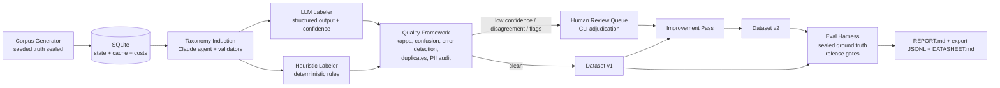

# BUILD BRIEF: data-quality-loop

**A training-data intelligence system: taxonomy induction, programmatic labeling, quality measurement, human-in-the-loop review, and a measured dataset improvement cycle, with an eval harness gating every release.**

Repo target: `github.com/melaskary72/data-quality-loop`
Builder: Claude Code, on Mohamed's Mac, with his Anthropic API key in `.env`
Audience: hiring team for a Forward Deployed Engineer role at a frontier-data company that builds training and evaluation data systems for leading AI labs. Their JD, verbatim themes: data intelligence systems for collecting, organizing, evaluating, and improving training and evaluation data; data taxonomies, labeling systems, and quality frameworks; ML pipelines for curation, evaluation, and continuous improvement; LLM applications including multi-agent systems, tool-using agents, RAG workflows, evaluation harnesses, and human-in-the-loop systems; full lifecycle ownership.

This repo must read as: the candidate already does the job.

---

## 0. NON-NEGOTIABLES (read before writing any code)

1. **Every number in the README comes from a real run.** No projected, estimated, or invented metrics anywhere. If a run has not happened, the README says so.
2. **Seeded ground truth is the honesty mechanism.** The corpus generator plants known phenomena (label errors, duplicates, ambiguous items, PII strings) and records them in a sealed ground-truth file. The quality framework is then scored on how many it actually caught. Recall against seeded truth is the headline metric.
3. **Evals run before the README is written.** If an eval pass exposes a bug (in the generator, the prompts, or the detectors), fix it, re-run, and record the incident honestly in the change log and Known Gaps. This happened on risk-decisioning-loop and it became a selling point. Do not hide it.
4. **Deterministic where possible.** Fixed seeds for the corpus generator and heuristic labeler. LLM calls are the only nondeterministic component and their raw responses are cached to SQLite so a re-run without `--fresh` is fully reproducible.
5. **Cost cap: 3 USD total** across all development and final runs. Track spend per call in SQLite; print cumulative cost after every batch. Use the cheapest capable Claude model via env var `DQL_MODEL` (default to a current small/fast model; do not hardcode a model that may be deprecated, read it from env with a sensible default).
6. **No heavyweight dependencies.** Python 3.11+, stdlib, `anthropic`, `pydantic`, `rapidfuzz`, `scikit-learn` (metrics only), `rich` (CLI output), `python-dotenv`. Optional: `resend` for the summary email. Nothing else without a written justification in the change log.
7. **No em dashes in any prose anywhere in the repo.** Use commas, colons, or periods.
8. **Secrets discipline.** `.env` in `.gitignore` from the first commit. Screenshots must never show the API key.

---

## 1. WHY THIS PROJECT (one paragraph for orientation, do not paste into README verbatim)

Frontier-data companies sell exactly one thing to AI labs: datasets whose quality can be measured, defended, and improved on a cycle. The hard problems are taxonomy design, labeling consistency, catching label errors at scale, knowing when to route an item to a human, and proving that iteration N+1 is measurably better than iteration N. This repo demonstrates that entire loop, small but real, with the same architecture discipline as a production system: deterministic rails, an LLM agent where judgment is needed, a heuristic fallback, humans in the loop for exactly the items that deserve them, and release gates that block a bad dataset from shipping.

---

## 2. REPO STANDARD (the Clarity way, mandatory)

This repo follows the documentation standard of `redlanternstudios/clarity_by_Nymbus`. That means, concretely:

### 2.1 Spec-first docs, written BEFORE implementation
- `specs/requirements.md`: numbered requirements (Req 1.1, 1.2, ...) grouped by capability. Every requirement testable.
- `specs/design.md`: the technical design, component boundaries, data flow, failure modes, and the reasoning behind each major decision.
- `specs/tasks.md`: the implementation plan as a checkbox list. **Every completed task gets a dated verification stamp** in italics under it, stating what was verified and how (command run, output observed). Example: `_Verified: 40 seeded label errors planted, 40 present in ground_truth.jsonl, checked via scripts/verify_seeds.py, 2026-09-04_`. Unfinished tasks stay unchecked. Never stamp what was not verified.

### 2.2 BUILD_CONTRACT.md at repo root
Locks the things that must not drift:
- One canonical dataset drives everything. No script invents values another script contradicts.
- The taxonomy, once induced and locked in `taxonomy.yaml`, is the single vocabulary. Every label everywhere must be a leaf of it.
- The sealed ground truth (`data/ground_truth.jsonl`) is read ONLY by the eval harness. Labeling and QA components must never import or read it. Enforce with a lint check in `scripts/check_contract.py` (grep for the path outside `eval/`).
- Cost cap, determinism rules, and dependency allowlist restated here.

### 2.3 SDLC package in `docs/`
Numbered files: `00-INDEX.md`, `01-REQUIREMENTS-SUMMARY.md`, `02-RISK-REGISTER.md` (real risks: LLM labeler bias toward frequent classes, kappa inflation on easy items, seeded-truth leakage, cost overrun), `03-ARCHITECTURE.md`, `04-ACCEPTANCE-CRITERIA.md`, `05-DEFINITION-OF-DONE.md`, `06-CHANGE-LOG.md` (dated entries, including bugs found and fixed), `07-AI-USAGE.md` (honest account: built with Claude Code, which parts were AI-written, how they were verified).

### 2.4 README.md structure (write LAST, after final runs)
1. Logo-free title + one-line description
2. **At a Glance table** (What / Why it matters, 5-6 rows)
3. **Headline results table**: real numbers from the final run (see Section 8 metrics)
4. Architecture diagram (Mermaid in README AND `assets/architecture.svg` exported)
5. Pipeline walkthrough with a real screenshot per stage (`assets/screenshots/01-...png` etc., captured from actual terminal output and the review CLI)
6. Quickstart (clone, `.env`, `make demo` or `python -m dql run-all`)
7. **The Improvement Cycle section**: v1 vs v2 metric table with deltas, this is the money section
8. **Known Gaps / Honest State**, dated, including anything found by evals and fixed
9. Reading order (contract, requirements, design, tasks, datasheet)
10. Folder map table
11. Cost line: total API spend for everything in the README

---

## 3. SYSTEM OVERVIEW

Domain: **enterprise support tickets** for a fictional B2B SaaS company ("Vantage-like" operational platform). Familiar to any reviewer, rich enough for a real taxonomy, zero licensing issues because we synthesize it.

Pipeline stages (each a CLI subcommand, each idempotent, state in SQLite):

```
generate -> induce -> label -> qa -> review -> improve -> evaluate -> report -> export
```

1. **generate**: synthesize the corpus with seeded phenomena and sealed ground truth.
2. **induce**: a Claude agent proposes a ticket taxonomy from an unlabeled sample; deterministic constraints validate it; human locks `taxonomy.yaml`.
3. **label**: dual labelers (LLM + heuristic) label every ticket with confidence.
4. **qa**: the quality framework computes agreement, finds suspected label errors, duplicates, PII leaks, and ambiguous items.
5. **review**: human-in-the-loop CLI queue for exactly the items QA routed; adjudications recorded.
6. **improve**: apply adjudications and automated fixes, producing dataset v2.
7. **evaluate**: eval harness scores everything against sealed ground truth; release gates pass or fail.
8. **report**: REPORT.md with v1 vs v2 deltas; optional Resend summary email.
9. **export**: fine-tune-ready JSONL splits plus `DATASHEET.md` (Datasheets for Datasets style).

### Architecture diagram (implement as Mermaid, export SVG to assets/)



---

## 4. COMPONENT SPECS

### 4.1 Corpus generator (`dql/generate.py`)
- ~600 tickets, fixed seed, templated + combinatorial synthesis (NO LLM calls here, keep generation free and deterministic). Fields: `ticket_id`, `subject`, `body`, `channel` (email/chat/portal), `customer_tier`, `created_at`, `vendor_label` (the intentionally imperfect "incoming labels", simulating a labeling vendor).
- Hidden ground-truth taxonomy used only by the generator and eval harness, 4 domains and 12 leaf classes. Suggested: Billing (invoice_dispute, refund_request, plan_change), Technical (login_auth_failure, data_sync_error, performance_degradation, api_integration_error), Account (user_provisioning, permissions_rbac, data_export_request), Product (feature_request, how_to_question).
- **Seeded phenomena, exact counts recorded in `data/ground_truth.jsonl` and in a `seed_manifest.json`:**
  - 40 vendor label errors (wrong leaf, plausible confusions, e.g. login_auth_failure mislabeled permissions_rbac)
  - 18 near-duplicate pairs (paraphrases of the same incident)
  - 30 genuinely ambiguous tickets (two defensible leaves; ground truth stores both, primary + acceptable_alt)
  - 25 tickets containing synthetic PII (fake emails, fake phone numbers, fake card-like number strings, clearly synthetic, e.g. 555 phones and test card prefixes) that must be caught and scrubbed before export
  - 12 tickets in mixed English/Arabic (Mohamed is native in both, and multilingual data is a real frontier-data problem)
- `scripts/verify_seeds.py`: asserts the manifest counts match what is actually planted. Run and stamp in tasks.md.

### 4.2 Taxonomy induction (`dql/induce.py`)
- Sample 120 tickets (stratified by nothing, it must not peek at ground truth), send to a Claude agent with a structured-output prompt: propose a 2-level taxonomy, max 4 domains, 8-14 leaves, each with `name`, `definition`, `inclusion_criteria`, `exclusion_criteria`, `boundary_examples`.
- Deterministic validators: leaf count bounds, no duplicate names, every sampled ticket assignable (agent must map the sample; unmappable rate < 5% or induction fails with a report).
- Output `taxonomy.yaml` plus `taxonomy_rationale.md` (the agent's reasoning, kept as an artifact). The human locks it; downstream stages refuse to run if `taxonomy.yaml` changes hash after labeling begins (record hash in SQLite).
- The induced taxonomy will NOT exactly match the hidden generator taxonomy. That is fine and realistic. The eval harness maps induced leaves to ground-truth leaves via a recorded alignment table (`eval/taxonomy_alignment.yaml`, written by hand during the build, documented in design.md).

### 4.3 Labeling engine (`dql/label.py`)
- **LLM labeler**: Claude with the locked taxonomy in-prompt (definitions + boundary examples, this is the RAG-lite grounding), structured JSON output: `label`, `confidence` (0-1), `rationale` (<= 25 words), `abstain` flag for unassignable items. Batched, cached by content hash, cost-tracked.
- **Heuristic labeler**: deterministic keyword/rule scorer per leaf (built from the taxonomy definitions, NOT from ground truth). Always produces a label + score. This is the fallback path and the second annotator.
- Both labelers write to SQLite; nothing overwrites, every labeling run is versioned (`run_id`).

### 4.4 Quality framework (`dql/qa.py`)
Computed over vendor_label vs LLM vs heuristic:
- **Inter-annotator agreement**: Cohen's kappa for each pair, plus raw agreement.
- **Per-class confusion matrices** and per-class precision/recall of vendor labels treating LLM labels as reference (clearly documented as a proxy, not truth).
- **Suspected label errors**: items where LLM and heuristic agree with each other and disagree with the vendor label at high confidence. Ranked list.
- **Duplicates**: rapidfuzz token-set ratio above threshold on subject+body; clusters reported.
- **PII audit**: regex battery (emails, phone formats, card-like sequences); every hit logged with span.
- **Ambiguity flags**: LLM abstains, or LLM confidence below 0.55, or all three annotators disagree three ways.
- Routing policy (deterministic, documented in design.md): suspected errors, ambiguity flags, and duplicate cluster representatives go to the human queue. Target queue size 60-100 items, i.e. the human reviews ~15% of the corpus, not all of it. That ratio is the point of the system.

### 4.5 Human review queue (`dql/review.py`)
- `rich`-based CLI: shows ticket, all three labels with confidences and rationales, taxonomy definitions on demand, keyboard adjudication (accept LLM / accept vendor / pick other leaf / mark ambiguous-both / mark duplicate / mark PII-confirmed).
- Every adjudication appended to `data/adjudications.jsonl` with timestamp and elapsed seconds. Mohamed personally does this pass; the README states the human review was real and how long it took.

### 4.6 Improvement pass (`dql/improve.py`)
Produces dataset v2 from v1 + adjudications + automated fixes: corrected labels, deduplicated (keep canonical, drop or merge paraphrases), PII scrubbed with typed placeholders (`[EMAIL_1]`), ambiguous items either dual-labeled or quarantined per adjudication. Deterministic, fully logged diff (`data/v1_to_v2_diff.jsonl`).

### 4.7 Eval harness (`eval/`)
The only code allowed to open `ground_truth.jsonl`. Scores both dataset versions:
- Label accuracy vs ground truth (primary; acceptable_alt counted per documented policy)
- **Seeded-error recall**: of the 40 planted vendor label errors, how many did QA flag; of those flagged, how many did the corrected v2 fix
- Duplicate recall (of 18 pairs) and precision
- PII recall (of 25) and precision, and post-scrub leak count (must be 0 in v2 export)
- LLM labeler accuracy, heuristic labeler accuracy, abstain calibration (accuracy on abstained items should be LOW, that means abstention is working)
- **Release gates (build fails loudly if unmet):** v2 label accuracy >= v1 + 5 points; seeded-error recall >= 85%; PII leak count in export == 0; duplicate recall >= 80%; total cost <= 3 USD.
- Output `eval/results_v1.json`, `eval/results_v2.json`, both committed.

### 4.8 Report + export (`dql/report.py`, `dql/export.py`)
- `REPORT.md`: headline table, v1 vs v2 deltas, confusion matrix images (matplotlib is NOT in the allowlist; render tables as markdown instead, keep it lean), cost accounting, human review stats (items, minutes, adjudication distribution).
- Optional `--email` flag sends a severity-gated summary via Resend (reuse the pattern from risk-decisioning-loop).
- Export: `export/train.jsonl`, `export/eval.jsonl` (stratified 85/15), plus `export/DATASHEET.md` covering motivation, composition, collection (synthetic, seeded, why), labeling process, quality metrics, known limitations, recommended uses. Labs live on datasheets; include it.

---

## 5. DATA MODEL (SQLite, `data/dql.db`)

Tables: `tickets(ticket_id, subject, body, channel, tier, created_at, vendor_label)`, `runs(run_id, stage, model, started_at, finished_at, cost_usd)`, `labels(run_id, ticket_id, source, label, confidence, rationale, abstain)`, `qa_flags(ticket_id, flag_type, detail, rank, routed_to_human)`, `adjudications(ticket_id, decision, final_label, reviewer, ts, seconds)`, `costs(call_id, run_id, tokens_in, tokens_out, usd, ts)`, `artifacts(name, sha256, locked_at)`.

---

## 6. CLI SURFACE

`python -m dql <cmd>`: `generate`, `induce`, `label [--source llm|heuristic|both] [--fresh]`, `qa`, `review`, `improve`, `evaluate [--version v1|v2|both]`, `report [--email]`, `export`, `run-all` (everything except `review`, which pauses and instructs the human), `status` (state + spend). Plus `make demo` wrapping `run-all`.

---

## 7. REPO LAYOUT

```
data-quality-loop/
  README.md  BUILD_CONTRACT.md  LICENSE  Makefile  .env.example  .gitignore
  specs/            requirements.md  design.md  tasks.md
  docs/             00..07 SDLC package
  dql/              __main__.py  generate.py  induce.py  label.py  qa.py
                    review.py  improve.py  report.py  export.py  store.py  llm.py
  eval/             harness.py  taxonomy_alignment.yaml  results_v1.json  results_v2.json
  scripts/          verify_seeds.py  check_contract.py
  data/             (db, ground_truth.jsonl [committed, it is synthetic], adjudications.jsonl, diffs)
  export/           train.jsonl  eval.jsonl  DATASHEET.md
  assets/           architecture.svg  screenshots/01-generate.png ... 08-report.png
  taxonomy.yaml     taxonomy_rationale.md  REPORT.md
```

---

## 8. HEADLINE METRICS TABLE (README template, fill with REAL numbers only)

| Metric | v1 (as delivered) | v2 (after loop) |
|---|---|---|
| Label accuracy vs ground truth | real | real |
| Seeded label errors caught (of 40) | real | corrected count |
| Duplicate pairs found (of 18) | real | merged count |
| PII items caught (of 25) / leaks in export | real | must be 0 leaks |
| Cohen's kappa, LLM vs heuristic | real | real |
| Items routed to human / total | real | |
| Human review time | real minutes | |
| Total API cost | real USD | |

---

## 9. BUILD ORDER (mirror into specs/tasks.md with stamps)

1. Scaffold repo, contract, specs skeletons, .env handling, store.py, cost tracking. Verify: `python -m dql status` runs clean.
2. Generator + verify_seeds.py. Verify counts.
3. Taxonomy induction + validators + lock. Verify hash lock refuses drift.
4. Heuristic labeler, then LLM labeler with cache. Verify cache hit on second run costs 0.
5. QA framework. Verify flag counts and routing size in range.
6. Review CLI. Mohamed does the human pass for real.
7. Improvement pass + diff.
8. Eval harness + alignment table + gates. If anything fails or exposes a bug, fix, re-run, log it in 06-CHANGE-LOG.md and Known Gaps.
9. Report, export, datasheet.
10. Screenshots of the real runs, architecture SVG, README last, docs package final pass, `scripts/check_contract.py` green.
11. Push, verify screenshots render on GitHub main, set repo description and topics (`training-data`, `data-quality`, `llm-agents`, `evals`, `human-in-the-loop`, `taxonomy`).

## 10. DEFINITION OF DONE

- [ ] All release gates pass on committed eval results
- [ ] Every number in README traceable to a committed results file
- [ ] Human review pass actually performed and adjudications.jsonl committed
- [ ] tasks.md fully stamped, change log honest, Known Gaps dated
- [ ] check_contract.py and verify_seeds.py both green in final commit
- [ ] Screenshots verified rendering on GitHub main from a logged-out browser
- [ ] Total spend printed in README and <= 3 USD
